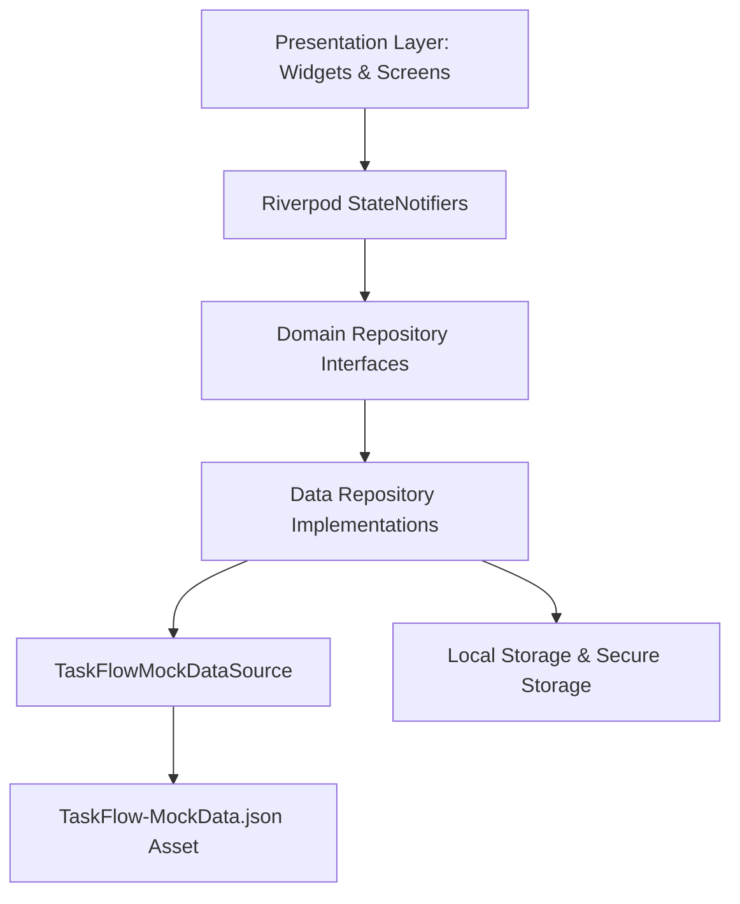
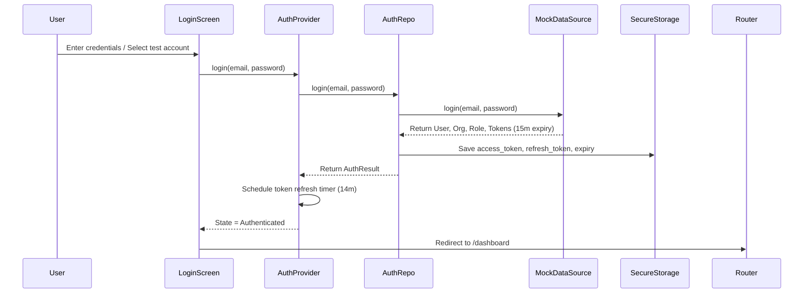

# TaskFlow — Architecture & Technical Design Document

This document details the architectural principles, state management strategy, data flow, and security enforcement mechanisms implemented in **TaskFlow**.

---

## 1. Clean Layered Architecture

TaskFlow adopts Clean Architecture principles to decouple business logic from UI widgets and external dependencies.



### Layer Responsibilities:

1. **Domain Layer (`lib/domain/`)**:
   - **Entities**: Immutable Dart classes representing business data (`TaskItem`, `Project`, `User`, `OrgMember`, `AuthToken`).
   - **Repositories**: Abstract contracts (`AuthRepository`, `ProjectRepository`, `TaskRepository`, `UserRepository`, `NotificationRepository`).
   - **Enums & Types**: `TaskStatus`, `TaskPriority`, `OrgRole`.

2. **Data Layer (`lib/data/`)**:
   - **Models**: Extend domain entities with `fromJson` and `toJson` serialization.
   - **Data Sources**: `TaskFlowMockDataSource` parses `assets/mock_data/TaskFlow-MockData.json`, manages in-memory mutations, persists state locally, and simulates network behavior.
   - **Repositories**: Concrete implementations of repository interfaces enforcing role rules and cross-org validation.

3. **Core Layer (`lib/core/`)**:
   - **Storage**: `SecureStorageService` (for token management) & `LocalStorageService` (for offline caching).
   - **Network & Debug**: `DebugOptionsManager` controlling latency and error injections.
   - **Router**: `GoRouter` with reactive auth guards.
   - **Theme**: Unified dark/light design system tokens.

4. **Presentation Layer (`lib/presentation/`)**:
   - **Providers**: Riverpod `StateNotifierProvider`, `FutureProvider`, and `Provider`.
   - **Screens**: Responsive views for authentication, projects, tasks, notifications, and settings.
   - **Widgets**: Reusable visual components (`StatusBadge`, `PriorityChip`, `UserAvatar`, `OfflineBanner`, `ConfirmDialog`, `SkeletonLoader`).

---

## 2. State Management Strategy (Riverpod)

We selected **Riverpod** (`flutter_riverpod`) for state management due to its compile-time safety, seamless dependency injection, and clean state handling (`AsyncValue`).

### Key Providers:

- `authProvider`: Manages `AuthState` (`uninitialized`, `unauthenticated`, `authenticating`, `authenticated`, `tokenExpired`, `error`). Automatically handles token expiration timers and silent refresh.
- `projectListProvider`: Manages `AsyncValue<List<Project>>` scoped to the current user's `org_id`.
- `taskListProvider`: Manages `AsyncValue<List<TaskItem>>` combined with `taskFilterProvider`.
- `taskFilterProvider`: StateNotifier tracking active filter parameters (project, status, priority, assignee, date range).
- `notificationsProvider`: Manages notification inbox state for the current user.
- `debugOptionsProvider`: Listenable notifier for reviewer test toggles.

---

## 3. Simulated Authentication & Token Lifecycle



### Auto Refresh Flow:
- When a user logs in, access and refresh tokens are issued with a 15-minute expiration (`access_token_expires_in_seconds: 900`).
- `AuthNotifier` sets a background timer to trigger a silent refresh 1 minute prior to expiration.
- If the app is reopened with an expired token, `checkSavedSession()` automatically executes `refreshToken()` using the saved refresh token.

---

## 4. Security & Business Logic Guards

1. **Role-Based Authorization (Admin vs Member)**:
   - Only users with `OrgRole.orgAdmin` can delete projects or manage organization settings.
   - Guarded in `ProjectRepositoryImpl.deleteProject`:
     ```dart
     if (userRole != OrgRole.orgAdmin) {
       throw PermissionException('403 Forbidden: Only org_admin can delete projects');
     }
     ```

2. **Cross-Organization Task Assignment Guard**:
   - `TaskRepositoryImpl.assignTask` verifies that the target assignee belongs to the active organization in `org_members`.
   - If an invalid user is selected, throws `ValidationException('Cannot assign user from a different organization')`.

---

## 5. Offline Awareness & Caching Strategy

- All mutations (creating/editing/deleting projects or tasks) write to in-memory state and persist immediately to `SharedPreferences` cache.
- When **Offline Mode** is toggled in Settings:
  - Mock network reads/writes return cached data instantly without throwing unhandled crashes.
  - An `OfflineBanner` is displayed across top of all screens to notify the user of cached data mode.
